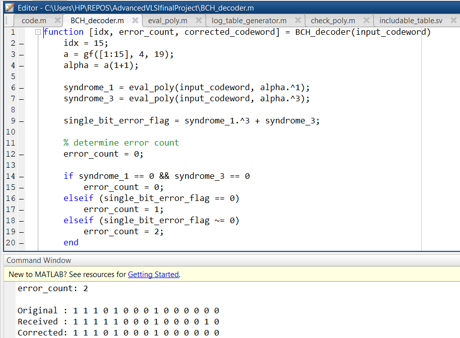
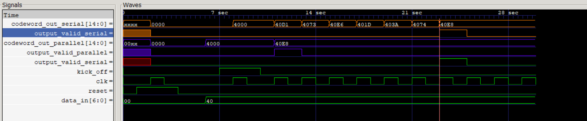
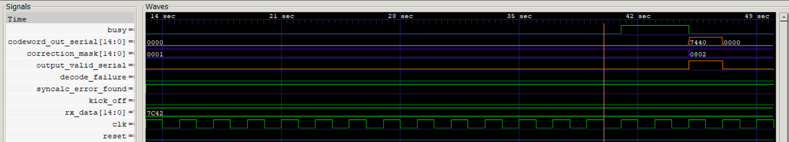
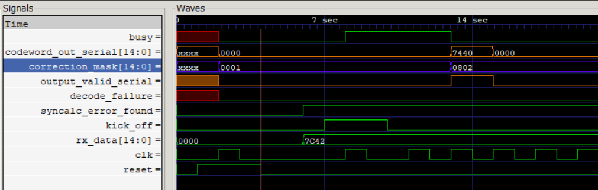
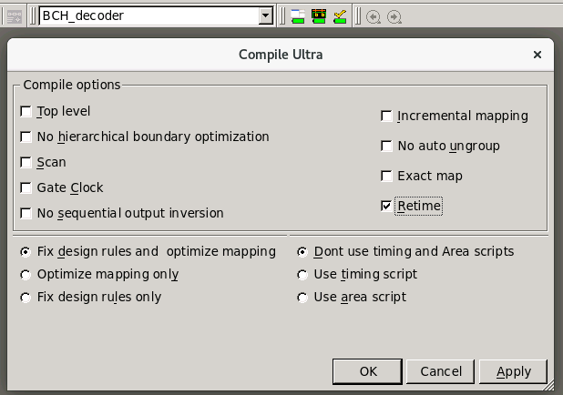

# Ultra Low Latency BCH Codec for 64B Cacheline Granularities

This is the report on Low Latency BCH encoder design project. It showcases:
- The MATLAB implementation of a simple BCH decoder.
- Verilog Simulation of BCH codec, with serial (traditional) and parallel (ultra-fast) implementations.
- Synopsis Design Compiler Timing Reports.

**Note**: Use `gns.ps1` script to simulate the design.

<h2>BCH Code Parameters</h2>

_keywords_: `DEC-TED`, `Truncated Code`, `Galois Field`, `Chipkill`

BCH codes are a class of linear error correction codes that use polynomial arithmetic over a _Galois Field_ for encoding and decoding. The details of the encoding/decoding theory are in the accompanying [presentation](./presentation.pdf).

The target of this project is to implement low-latency BCH encoders and decoders for cacheline granularities (64 B).

BCH codes are defined over length $n = 2^m - 1$, where $m$ is the extent of the Galois field (total number of elements in the field), and $n$ is length of a coded message. The number of original message bits is denoted $k$, and is a function of the error correction capability (single error correct, double error correct etc.; denoted as $t=1, 2...$) of the code.

To keep the decode latency predictable and low, and to model a system that compares with **IBM's Chipkill**, I have chosen a DEC-TED (Double Error Correct, Triple Error Detect) BCH code that works at a **sub-cacheline granularity**. For this code, $m=8$. Consequently, the code is defined as a BCH code of $\(n, k\) = \(255, 239\)$.

Since the $\(n, k\) = \(255, 239\)$ code does not have a message or codeword length divisible by 8, I have chosen to drop $111$ Most Significant Bits of both the codeword and the message. So, in effect, the codeword can be written as $\(n, k\) = \(255-111, 239-111\) = \(144, 128\)$. Which means our message is going to be **16 Bytes** long, with **2 Bytes** of redundancy appended at the end.

This dropping of MSbits does not change the encoding or decodig algorithm at all. In fact, this results in lesser physical resource consumption, and smaller encode and decode lengths, which is an advantage. Additionally, this also allows for a native way of decode failure detection: e.g. for triple error, or more than that, if the corrected codeword has a bit flipped from the truncated MSbits, we know that the error correction process has faced a catastrophic failure.

Finally, I use **16 × 4** such message/code pairs to get a total message length of **64 Bytes**, and a total codeword length of **18 × 4 = 72 Bytes**. This means we can correct a total of **2*4 = 8** bits, albeit they must be distributed over 4 different blocks, with each block ensuring 2 bits worth of error correction.


<h2>MATLAB Section</h2>

_keywords:_ `MATLAB Simulation`, `Polynomial Lookup Generation`

MATLAB was used to craft a model for RTL implementation, and to generate Galois Field look-up tables for **log** and **power** operations, which were used in RTL. The source filed are attached herewith, and have **.m** extenstions.

Below is the screenshot of the MATLAB DEC-TED BCH decoder in action:



<h2>RTL Design</h2>

The core philosophy of design for low latency implemenation is:

1. Unfold the serial operation in RTL, and then use re-timing in **Synopsys Design Compiler** to meet the clock frequency constraints.

2. Make the common case fast: I have manually accelerated the cases of single error, and zero error. For the unlikely case of 2 errors, I have not unfolded the circuitry (**Chien Search Module**) that will not be used very often anyways.

Traditionally, BCH codecs are woefully serial machines. The latency of an encoder is usually $k$ clock cycles. For our case that would be **128 cycles** or **128 ns** at a **1 GHz** clock. Using unfolding and re-timing, I was able to get an **8 deep** pipeline that meets **1 GHz** clock constraints. This means a latency of just **8 ns**, which is superior by a factor of **16**.

Similarly, a serial decoder takes $n$ clock-cycles at best (assuming 0 or 1 errors), i.e. a latency of **144 ns**. With unfolding, I got the best case latency of only **2 ns**. That's better by a factor of **72**.

<h2>RTL Simulation</h2>

<h3>Encoder Simulation</h3>

I have simulated the design using iVerilog and GTKwave. Below is the simulation of encoders (serial and parallel in comparison):



To showcase the results in a single this simulation has a more manageable codeword and message length: $\(n, k\) = \(15, 7\). As can be seen, the parallel encoder (in purple) is ready quite before the serial encoder, and both output the correct systematic codeword of `40E8`.

<h3>Decoder Simulation - Double Error</h3>

_Serial Decoder_:




_Parallel Decoder_:



Again, the parallel Decoder emits its results much earlier.

<h2>Synthesis using Synopsys Design Compiler</h2>

The Synopsys Design  Compiler is invoked by entering `design_vision` in the terminal. At the beginning of a new project, one must expose the cell libraries that are to be used for synthesis and compilation. A setup script written to achieve that looks like the one given below:

```bash
# Define the target logic library, symbol library,
# and link libraries
set_app_var target_library lsi_10k.db
set_app_var symbol_library lsi_10k.sdb
set_app_var synthetic_library dw_foundation.sldb
set_app_var link_library "* $target_library $synthetic_library"
set_app_var search_path [concat $search_path ./src]
set_app_var designer "Asad"
# Define aliases
alias h history
alias rc "report_constraint -all_violators"
```

This script sets up `lsi_10k` library as a source for cells and technology specific constraints. In actual synthesis, I have used `FreePDK-45`, which is a free, **45 nm** library available all over the internet.

<h3>Steps for Design Compilation</h3>

I have been using the following steps to compile my FIR implementations:

1. Setup cell library (as stated above).
2. Analyze the verilog module to be synthesized. Use `File -> Analyze`. It turns out that the design compiler supports a very strict subset of verilog. One may have to re-tailor the code at some spots to make it pass with a design compiler.
3. Elaborate the top module. Use `File -> Elaborate`.
4. Specify timing and load capacitance constraints. I have batched my specifications in a `tcl` script given below:
   ```tcl
   link
   uniquify
   # specify clk
   create_clock clk -period 42 -waveform {0 20}
   set_clock_latency 0.3 clk
   set_input_delay 2.0 -clock clk [all_inputs]
   set_output_delay 1.65 -clock clk [all_outputs]
   # specify clk_serial
   create_clock clk_serial -period 14 -waveform {0 7}
   set_clock_latency 0.3 clk_serial
   set_input_delay 2.0 -clock clk_serial [all_inputs]
   set_output_delay 1.65 -clock clk_serial [all_outputs]
   # specify loads
   set_load 0.1 [all_outputs]
   set_max_fanout 1 [all_inputs]
   set_fanout_load 8 [all_outputs]
   report_port
   ```
5. Check Design. Use `Design -> Check Design`.
6. Compile Design. USe `Design -> Compile Design Ultra`. The Ultra option allows for aggressive `re-timing`. This is shown in the picture below:



<h3>Steps for Report Generation</h3>

From here on, one can generate **timing, area and power** reports. The steps to do that are as follows:

1. Use `Timing -> Report Timing Path` to generate timing reports. The crucial metric here is the **slack**. Defined in units of nano-seconds, it is the spare time budget of the critical path for a specified clock period. For example, let's assume a specified clock period of 100 ns, and a critical path of 98 ns. Here, the slack will be calculated as: `specified clock period - critical path propagation delay = +2 ns`. This means that we can still decrease the clock period by 2 ns, and the design will keep working. On the other hand, a negative slack means that the timing constraints have failed. As an example, a slack of -2 ns means that we have to slow the clock down by 2ns to meet timing requirements.
2. Use `Design -> Report Area` to generate an area report. Area is reported in terms of cells used.
3. Use `Design -> Report Power` to generate power estimation reports.

<h2>Post-synthesis Timing Reports</h2>

Screenshots of post-synthesis/post-compilation reports for different designs can be found in the directory `Pictures/SynopsysDesignCompiler`. In the interest of brevity, I will show only the reports of the tough case: the parallel BCH decoder:


<h2>Analysis and Conclusion</h2>

1. The BCH enoder/decoder achieved by unfoling and retiming exhibit very low latencies for commonly faced cases.
2. The Chien Search algorithm, while unfoldable, is so rarely invoked (multiple errors), that one is better off in keeping it serial.
3. For single error cases, one does not need to do complex searches, as the location of the error can be deduced with simple logarithm look-ups. This allows for low-latency decoding.
4. Synopsys Design Compiler's `Compile Ultra` option is a hidden gem. It can optimize the placements to meet unbelievably strict targets.