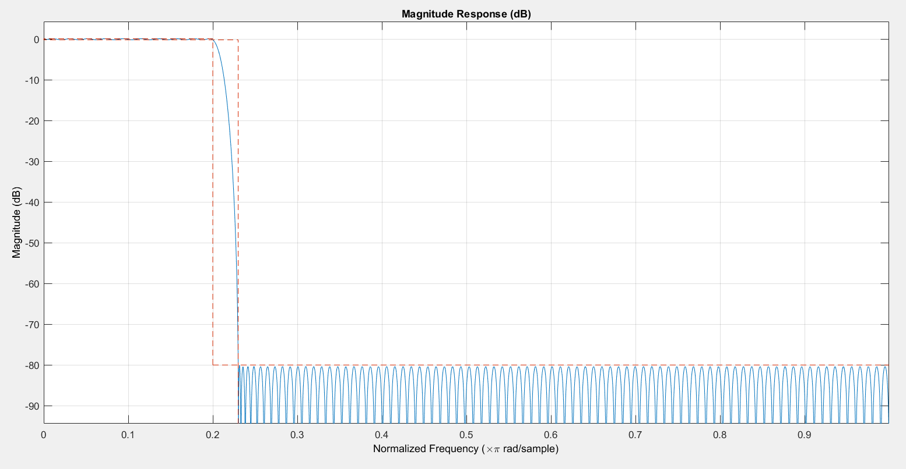
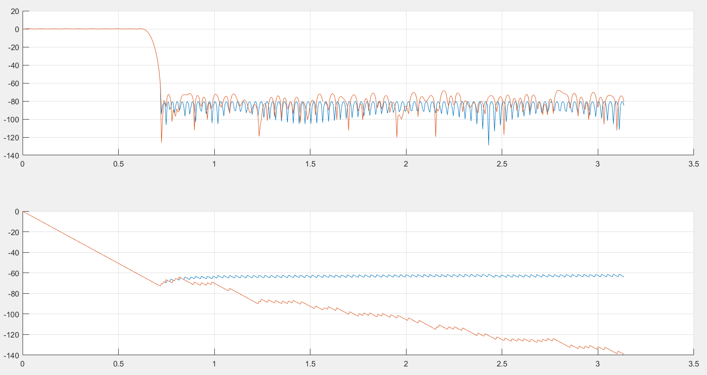

# AdvancedVLSIdesign
Contains project submissions for Advanced VLSI Design course - Spring 2024

<h2>MATLAB Section</h2>

Keywords: `FIR filter design`, `Q-formats`, `quantization noise`

MATLAB's `designfilt` tool was used to design a filter with required properties, i.e., with a transition region of **0.2$\pi$ to 0.23$\pi$ rad/sample**, and a **stop-band attenuation of 80 dB**.

<h3>Filter Details</h3>

The filter was generated using the equiripple design method. The command used to generate the filter is as follows:

```MATALAB
lpf_equi = designfilt('lowpassfir', 'PassbandFrequency', .2, 'StopbandFrequency', 0.23, 'PassbandRipple', 0.308, 'StopbandAttenuation', 80, 'DesignMethod', 'equiripple');
```

For the given constraints, a decent equiripple design takes more than 100 taps. For low passband ripple, and for ease of decomposition during L2 and L3 parallel filter design, I have chosen to implement a filter with **204 taps**.

The filter impulse response, extracted using `fvtool` utility in MATLAB, is given below:



As can be seen, the response is that of an equiripple low-pass filter, with stop-band attenuation of the 80 dB, and requisite transition region width of 0.03 $\pi$ rad/sample.

<h3>Filter Quantization</h3>

The absolute maximum value for filter coefficients (the top of the sinc function, i.e. the value in the middle) was **0.2069**. Considering this, a fixed-point representation format of signed Q1.15 was chosen. This means that the coefficients will be stored in 16-bit numbers. 1 bit will be used to represent the sign, and 15 bits will be used to represent the fractional part.

The post quantization frequency response is given in the following figure:



The top figure shows the magnitude response, while the bottom figure shows the phase response. The *blue* traces represent the original/un-quantized filter response, wheras the *orange* trace shows the post quantization response. As can be, quantization impacts the stop-band: the response is not longer perfectly equiripple, and the stop-band attenuation is no more below the stipulated 80 dB - it now goes as high as around 74 dB.

<h4></h4>

The MATLAB script in the file `code.m` was used to generate the filter, quantize it, display the filter impulse response, and dump the filter coefficients for verilog consumption.

<h2>FIR implementations in Verilog HDL</h2>

One could think of many ways to implement FIR filters in hardware. I have implemented the given low-pass FIR filter in the following flavors:

1. **Direct Form**: *The naive design. Uses a massive adder to sum up all delayed multiplication products. This massive adder adds 204 products combinationally. Results in an atrociously long critical path*.
2. **Pipelined Direct Form**: _The adder from the above design is pipelined: It is broken down logarithmically, with every further stage requiring half or so number of adders than the last one._
3. **Broadcast Form**: _The FIR filter is expressed in a form which is naturally pipelined, and uses a low resource count. The input samples are **broadcast** to all the multipliers at once._
4. **PBroadcast Form with Finegrain Pipelining**: _The multipliers in broadcast form are finegrain-pipelined._
5. **Symmetric Broadcast Form**: _Since the coefficients of a low-pass filter are symmetric around x-axis, half the mulitplications in broadcast form are redundant. We can exploit this symmetry and reduce the multiplier count by half, since any two multipliers at an equal distance from the middle will have the same output. This only works for non-parallel implementations, because in parallel implimentations, the coefficients of subfilters are not symmetric._

Given below are the design block diagrams of different FIR implementations:

<h3>1. Direct Form</h3>

This is the most naive form, derived from the convolution expression ```math x(t) \circledast h(t) &= y(t)```. As can be seen in the figure, this implementation needs a huge adder, which combinationally adds the outputs of all the multipliers. This results in a horribly long critical path. 


<h3>2. Pipelined Direct Form</h3>

This implementation breaks down the slow adder from above implementation to a log-pipelined adder. Every stage adds only two operands, and passes on the result to the next stage. This results in a total adder count of `FILTER_SIZE-1`. These pipelined stages help reduce the critical path.

A useful tip is to limit the log-pipelining stages to such an extent that the adder critical path is broken down into a path that is _just_ shorter than the second worst critical path. Any further pipelining will not help in slack reduction, but still consume area/cell resources.

Through experimentation, I found that 6 combinational adders at the final stage do not form the critical path. This is reflected in the verilog code.


<h3>3. Broadcast Form</h3>

The broadcast representation of an FIR filter is inherently pipelined. It also uses less delay elements in comparison to pipelined direct form. The block diagram is given below:


<h3>4. Broadcast Form with Finegrain Pipelining</h3>

Supports additional, 1 stage fine-grained pipelining between adders and multipliers.


<h3>Symmetric Broadcast Form</h3>

broadcast_fir_symmetric


<h2>Testbench Simulation Results</h2>

<h2>Synthesis using Synopsis Design Compiler</h2>

<h2>Post-synthesis timing and resource/power usage reports</h2>

<h2>Conclusion</h2>


