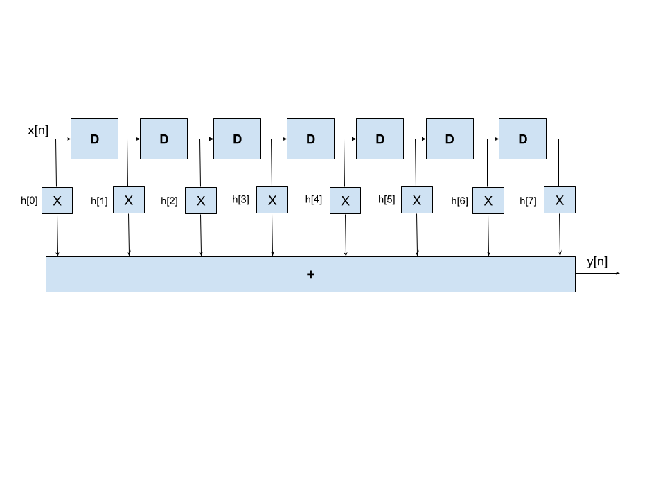
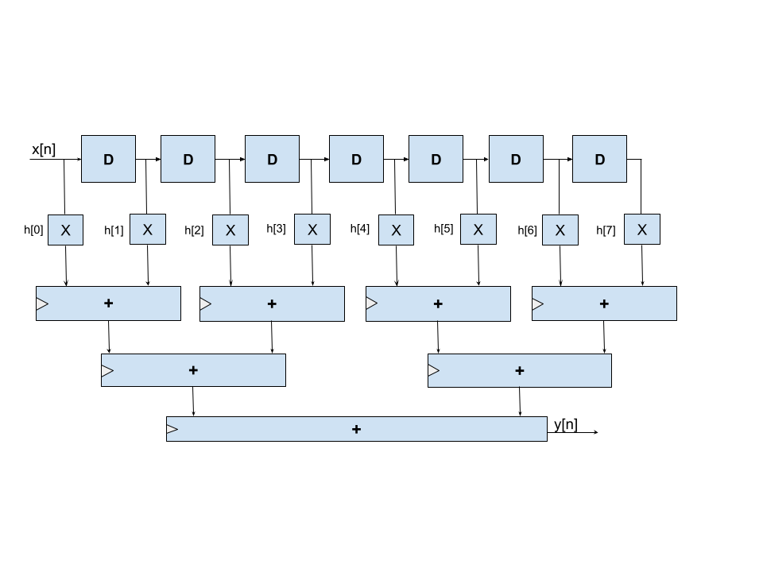
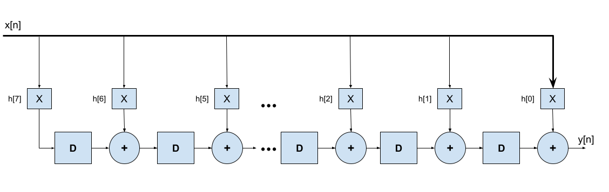
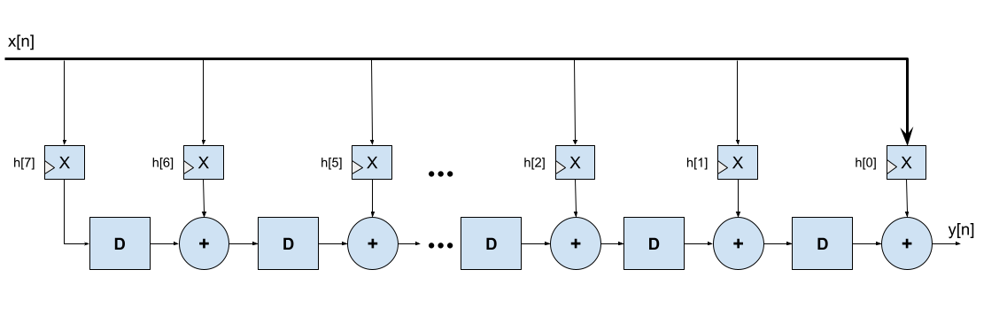
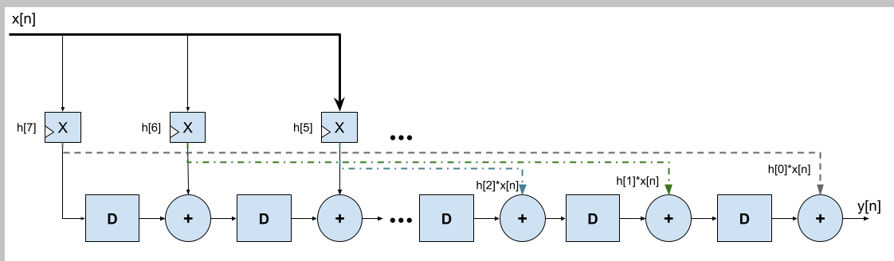
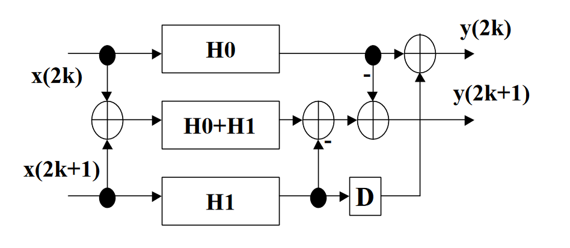
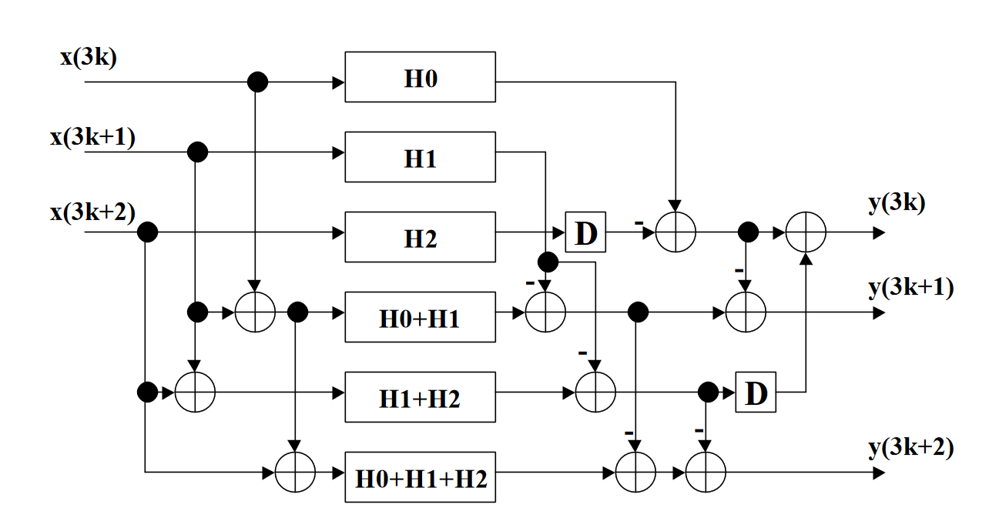

# AdvancedVLSIdesign
Contains project submissions for Advanced VLSI Design course - Spring 2024

<h2>MATLAB Section</h2>

Keywords: `FIR filter design`, `Q-formats`, `quantization noise`

MATLAB's `designfilt` tool was used to design a filter with required properties, i.e., with a transition region of **0.2 $\pi$ to 0.23 $\pi$ rad/sample**, and a **stop-band attenuation of 80 dB**.

<h3>Filter Details</h3>

The filter was generated using the equiripple design method. The command used to generate the filter is as follows:

```MATALAB
lpf_equi = designfilt('lowpassfir', 'PassbandFrequency', .2, 'StopbandFrequency', 0.23, 'PassbandRipple', 0.308, 'StopbandAttenuation', 80, 'DesignMethod', 'equiripple');
```

For the given constraints, a decent equiripple design takes more than 100 taps. For low passband ripple, and for ease of decomposition during L2 and L3 parallel filter design, I have chosen to implement a filter with **204 taps**.

The filter impulse response, extracted using `fvtool` utility in MATLAB, is given below:


As can be seen, the response is that of an equiripple low-pass filter, with stop-band attenuation of the 80 dB, and requisite transition region width of 0.03 $\pi$ rad/sample.

<h3>Filter Quantization</h3>

The absolute maximum value for filter coefficients (the top of the sinc function, i.e. the value in the middle) was **0.2069**. Considering this, a fixed-point representation format of signed $Q1.15$ was chosen. This means that the coefficients will be stored in 16-bit numbers. 1 bit will be used to represent the sign, and 15 bits will be used to represent the fractional part.

The post quantization frequency response is given in the following figure:


The top figure shows the magnitude response, while the bottom figure shows the phase response. The *blue* traces represent the original/un-quantized filter response, wheras the *orange* trace shows the post quantization response. As can be seen, quantization impacts the stop-band: the response is not longer perfectly equiripple, and the stop-band attenuation is no more below the stipulated 80 dB - it now goes only as low as around 74 dB.

<h4></h4>

The MATLAB script in the file `code.m` was used to generate the filter, quantize it, display the filter impulse response, and dump the filter coefficients for verilog consumption.

<h2>FIR implementations in Verilog HDL</h2>

One could think of many ways to implement FIR filters in hardware. I have implemented the given low-pass FIR filter in the following flavors:

1. **Direct Form**: *The naive design. Uses a massive adder to sum up all delayed multiplication products. This massive adder adds 204 products combinationally. Results in an atrociously long critical path*.
2. **Pipelined Direct Form**: _The adder from the above design is pipelined: It is broken down logarithmically, with every further stage requiring half or so number of adders than the last one._
3. **Broadcast Form**: _The FIR filter is expressed in a form which is naturally pipelined, and uses a low resource count. The input samples are **broadcast** to all the multipliers at once._
4. **Broadcast Form with Finegrain Pipelining**: _The multipliers in broadcast form are finegrain-pipelined._
5. **Symmetric Broadcast Form**: _Since the coefficients of a low-pass filter are symmetric around y-axis, half the mulitplications in broadcast form are redundant. We can exploit this symmetry and reduce the multiplier count by half, since any two multipliers at an equal distance from the middle will have the same output._

Given below are the design block diagrams of different FIR implementations:

<h3>1. Direct Form</h3>

This is the most naive form, derived from the convolution expression of an FIR. As can be seen in the figure, this implementation needs a huge adder, which combinationally adds the outputs of all the multipliers. This results in a horribly long critical path. 



<h3>2. Pipelined Direct Form</h3>

This implementation breaks down the slow adder from above implementation to a log-pipelined adder. Every stage adds only two operands, and passes on the result to the next stage. This results in a total adder count of `FILTER_SIZE-1`. These pipelined stages help reduce the critical path.

A useful tip is to limit the log-pipelining stages to such an extent that the adder critical path is broken down into a path that is _just_ shorter than the second worst critical path. Any further pipelining will not help in slack reduction, but still consume area/cell resources.

Through experimentation, I found that 6 combinational adders at the final stage do not form the critical path. This is reflected in the verilog code.



<h3>3. Broadcast Form</h3>

The broadcast representation of an FIR filter is inherently pipelined. It also uses less delay elements in comparison to pipelined direct form. The block diagram is given below:



<h3>4. Broadcast Form with Fine-grained Pipelining</h3>

Supports additional, 1 stage fine-grained pipelining between adders and multipliers.



<h3>5. Symmetric Broadcast Form</h3>

An equiripple low-pass FIR filter is symmetric around the y-axis, i.e., `h[n] == h[FILTER_SIZE-n-1]`. This means that the results of multiplications are also symmetric around the center of the broadcast FIR. We can use this symmetry to eliminate half of the redundant FIRs.

The block diagram of a modified broadcast FIR is shown below:



The symmetry exploitation only works for non-parallel implementations, because in parallel implimentations, the coefficients of subfilters (decomposed filters H0, H1, H2 etc.) are not symmetric.

<h3>6. L2 Parallel Form</h3>

The L2 parallel form is the reduced-complexity parallel implementation of the given filter. It employs filter decomposition and clever recombination to achieve a parallel implementation capable of _2x_ throughput of the broadcast form, while using around _1.5x_ filter hardware resources.

One feature of note: The L2 parallel design uses two clocks; one for processing, and one for serialization/de-serialization of inputs and outputs. The ser-des clock has twice the frequency to keep the filter fed at all times.

Below is the block-diagram I used as a reference to implement the L2 parallel design:



<h3>7. L3 Parallel Form</h3>

The L3 frequency works on essentially on the same principle as L3. It can give _3x_ throughput while using _2x_ filter resources (The L3 implementation has 6 filters, with each having a length of 1/3 of the original).

The L3 system is also fed using a _3x_ faster clock that is used for serialization and de-serialization of the incoming/outgoing data. The internal core works in parallel at a slower clock.

Below is the block-diagram I used as a reference to implement the L2 parallel design:



Since both L2 and L3 parallel designs use broadcast FIR filters as their basic building blocks, one must make sure that the filter coefficients are passed on in the inverted order (i.e. `h[0]` goes to the last multiplier, and `h[N-1]` goes to the first multiplier). Otherwise, filter recombination is incorrect and will produce wrong results.

<h3>Avoiding Overflows in Filter Design</h3>

The following points explain my rationale in choosing output bitwidths to avoid overflows:

- As stated in the MATLAB section, the filter coefficients are stored in signed $Q1.15$ fixed-point format, and need 16-bits each.
- Given that every input `x[n]` is also constrained between $-0.999$ and $+0.999$, we can use the same signed $Q1.15$ format to represent inputs.
- This means that every multiplication (product of 2 signed 16-bit numbers in $Q1.15$ format) will occupy 32-bit, and have a $Q2.30$ as format. Both of the two non-fractional bits represent sign bit. So we have 31 bits of information at the output of each multiplier.
- Since we have a $204$ tap filter, we need to perform 204 additions on the multiplication outputs.
- Every 2-operand addition has the potential to add 1 more bit to the output, given that both operands are max representable values in the given fixed-point format.
- Since we can breakdown the 204 additions into a log-tree with 8 steps, we need 8 more fractional bits to avoid overflow. This is corroborated by the fact that since our max multiplication output is $~0.9999%, 204 such additions will result in something aroung $203.999$, which needs 8 non-fractional bits.
- So to avoid overflow, the final adder output must have at least 8 non-fractional bits.
- In the interest of saving resources, we can drop the lower, fractional bits of multipliers, and translate the q-format from $Q2.30$ to $Q1.15$ at a moderate precision loss.
- Then, the required final Q-format at the adder outputs is $Q9.15$, and needs 24-bits.


<h2>Testbench Simulation Results</h2>

<h2>Synthesis using Synopsis Design Compiler</h2>

<h2>Post-synthesis timing and resource/power usage reports</h2>

<h2>Conclusion</h2>


